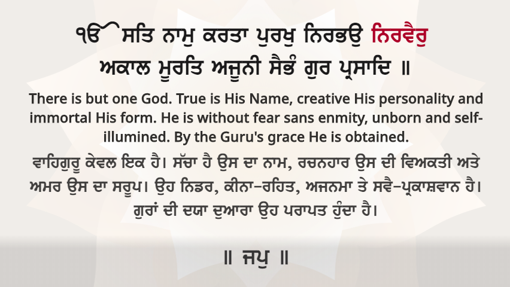
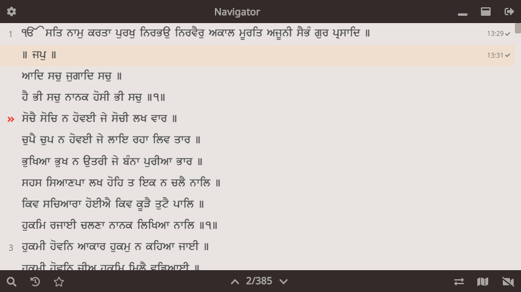
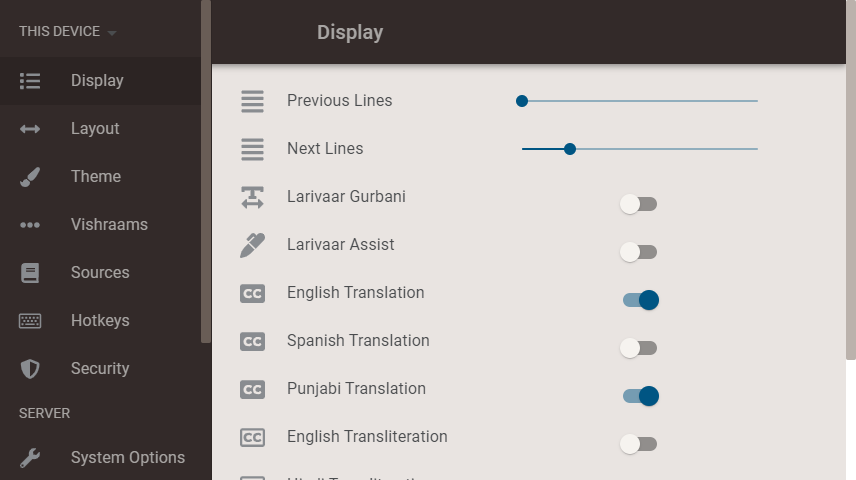

:repo: presenter
:idprefix:
:hide-uri-scheme:
:numbered:
:max-width: 900px
:icons: font
:toc: macro
:toclevels: 4
:logo: https://raw.githubusercontent.com/ShabadOS/presenter/dev/resources/icon.png
:website: https://shabados.com
:contributors-url: https://github.com/shabados/{repo}/graphs/contributors
:cci-img: https://img.shields.io/circleci/project/github/ShabadOS/{repo}.svg?label=Build&logo=circleci
:cci-url: https://circleci.com/gh/ShabadOS/{repo}
:download-img: https://img.shields.io/github/downloads/ShabadOS/{repo}/latest/total.svg?label=Downloads&logo=github
:download-url: https://github.com/ShabadOS/{repo}/releases
:license-img: https://img.shields.io/github/license/ShabadOS/{repo}.svg?label=License&logo=read-the-docs&logoColor=white
:license-url: https://github.com/ShabadOS/{repo}/LICENSE.adoc
:instagram-img: https://img.shields.io/badge/Instagram-%40shabad__os-C13584.svg?logo=instagram&logoColor=white
:instagram-url: https://www.instagram.com/shabad_os/
:twitter-img: https://img.shields.io/badge/Twitter-%40shabad__os-1DA1F2.svg?logo=twitter&logoColor=white
:twitter-url: https://www.twitter.com/shabad_os/
:chat-img: https://img.shields.io/badge/Chat-Public%20Slack%20Channels-1264a3.svg?logo=slack
:chat-url: https://chat.shabados.com
:wa-img: https://img.shields.io/badge/WhatsApp-%2B1%20516%20619%206059-128C7E.svg?logo=whatsapp&logoColor=white
:wa-url: https://wa.me/15166196059
ifdef::env-github,env-browser[:outfilesuffix: .asciidoc]
ifdef::env-github[]
:note-caption: :information_source:
:tip-caption: :bulb:
:important-caption: :fire:
:caution-caption: :warning:
:warning-caption: :no_entry:
endif::[]

image::{logo}[128,128,link="{website}"]

# Shabad OS Presenter

Software for searching, navigating, and presenting the Shabad OS Database.

image:{cci-img}[title=CircleCI, link="{cci-url}"] image:{download-img}[title=Github All Releases, link="{download-url}"] image:{license-img}[title=license, link="{license-url}"]

---
toc::[id="toc"]
---

## Introduction

The Shabad OS Presenter is a GPL-licensed open source project with ongoing development, project management, and marketing made possible entirely by the support and dedication of unpaid volunteers.

This app can be used to display bani & gurbani in the home or at the gurdwara. A server model allows multiple devices to act as a display or a controller. The same model enables live captions to be in sync with the projector / presentation device.

Helpful features were added over years of production-ready use.

See:

* {website}[Our Website]
* https://tutorials.shabados.com/tutorials/1.0.0/basics/install.html[How to install]
* https://tutorials.shabados.com/tutorials/1.0.0/overlay/add-live-streaming-captioning.html[How to add live stream captions]

### Features

* Multiple displays and controllers in sync
* Live broadcast captioning / subtitling
* Curated design
  ** Text legibility/readability
  ** Organized UI/UX functionality
* Keyboard shortcuts 
  ** Search, History, Bookmarks
  ** Jump to line _N_ of shabad 
  ** Autoselect line based on context/position

### Screenshots

### Community

Get updates on Shabad OS and chat with the project maintainers and community members.

* image:{instagram-img}[title=Instagram, link="{instagram-url}"] Follow Shabad OS on Instagram. 
* image:{twitter-img}[title=Twitter, link="{twitter-url}"] Follow Shabad OS on Twitter. 
* image:{chat-img}[title=Chat, link="{chat-url}"] Join the official Slack channel. 
* image:{wa-img}[title=WhatsApp, link="{wa-url}"] Direct message us on WhatsApp. Or chat with fellow Shabad OS community members in the WhatsApp group chat.

## Contributing

There are many ways in which people can participate in Shabad OS projects. For example:

* link:https://github.com/ShabadOS/{repo}/issues/new[Submit bugs and feature requests]. Help us verify whether they are resolved. See our link:https://github.com/ShabadOS/{repo}/issues[issue tracker].
* Review documentation and make pull requests for anything from typos to new content.
* Give feedback on the onboarding process to make it easier for others to join the project.

If you are interested in fixing issues and contributing directly to the presenter repo, please see the document link:CONTRIBUTING.adoc[How to Contribute], which covers the following:

* link:CONTRIBUTING.adoc#Getting-Started[How to build and run from source]
* link:CONTRIBUTING.adoc#Workflow[The development workflow]
* link:CONTRIBUTING.adoc#Coding-Guidelines[Coding guidelines]

And "Thank you!" to link:{contributors-url}[all the volunteers] who've already contributed to Shabad OS!

## Feedback

* Ask a question via {chat-url}[Slack] or {wa-url}[WhatsApp]
* link:https://github.com/ShabadOS/{repo}/issues/new[Request a new feature]
* link:https://github.com/ShabadOS/{repo}/issues?q=is%3Aopen+is%3Aissue+label%3A%22Type%3A+Feature%2FEnhancement%22+sort%3Areactions-%2B1-desc[Upvote popular feature requests] using the thumbs-up/+1 reaction on the first post of a feature request
* link:https://github.com/ShabadOS/{repo}/issues/new[File an issue]
* Follow {instagram-url}[@shabad_os on Instagram] and {twitter-url}[@shabad_os on Twitter] and let us know what you think!

## Related Projects

Projects in the Shabad OS ecosystem of free and open source software which interact with or are used by the presenter repo include:

* link:https://github.com/ShabadOS/database[Database] as an npm module enables access to JS libs used for querying
* link:https://github.com/ShabadOS/gurmukhi-utils[Gurmukhi Utils] is used to swap input/output between ascii/unicode gurmukhi

## Code of Conduct

Please note that this project is released under the Contributor Covenant. By participating in this project you agree to abide by its terms. Our intention is to signal a safe open-source community by welcoming all people to contribute, and pledging in return to value them as whole human beings and to foster an atmosphere of kindness, cooperation, and understanding.

> We as members, contributors, and leaders pledge to make participation in our community a harassment-free experience for everyone, regardless of age, body size, visible or invisible disability, ethnicity, sex characteristics, gender identity and expression, level of experience, education, socio-economic status, nationality, personal appearance, race, religion, or sexual identity and orientation.

> We pledge to act and interact in ways that contribute to an open, welcoming, diverse, inclusive, and healthy community.

> link:https://www.contributor-covenant.org/version/2/0/code_of_conduct/[The Contributor Covenant]

## License

The presenter repo is under v3 of the link:LICENSE.adoc[GPL]. It is similar to the Golden Rule: do unto others as you would have them do unto you. In exchange for benefitting from the work completed in this repo, others must share their derivative work under v3 of the link:LICENSE.adoc[GPL].

****
This program is free software: you can redistribute it and/or modify it under the terms of the GNU General Public License as published by the Free Software Foundation, either version 3 of the License, or (at your option) any later version.

This program is distributed in the hope that it will be useful, but WITHOUT ANY WARRANTY; without even the implied warranty of MERCHANTABILITY or FITNESS FOR A PARTICULAR PURPOSE. See the GNU General Public License for more details.

You should have received a copy of the GNU General Public License along with this program. If not, see <https://www.gnu.org/licenses/>.
****

### Attribution/Credit

Though the presenter repo has no database, it is strongly related with the Shabad OS database. To learn more about the licensing of the database, please refer to the link:https://github.com/ShabadOS/database#licenses[Database README.adoc]
